# Table of Content

-   [Table of Content](#table-of-content)
-   [Overview](#overview)
-   [Data Types](#data-types)
    -   [Vector Maps](#vector-maps)
-   [User Privileges and Roles](#user-privileges-and-roles)
    -   [Managing Vector Maps](#managing-vector-maps)
-   [Explore Maps](#explore-maps)
    -   [Explore Vector Maps](#explore-vector-maps)
    -   [Overlay Custom GeoJSON](#overlay-custom-geojson)
    -   [Share / Export Maps](#share--export-maps)
-   [Managing Maps](#managing-maps)
    -   [Manage Vector Maps](#manage-vector-maps)
        -   [Create Vector Maps](#create-vector-maps)
        -   [Edit Vector Maps](#edit-vector-maps)
            -   [Create a New Feature](#create-a-new-feature)
            -   [Edit an Existing Feature](#edit-an-existing-feature)
            -   [Edit Metadata](#edit-metadata)
            -   [Transfer Roles](#transfer-roles)
            -   [Control the Version](#control-the-version)
            -   [Delete a Vector Map](#delete-a-vector-map)
            -   [Edit Vector Maps with an External Geojson Source](#edit-vector-maps-with-an-external-geojson-source)

# Overview

## Welcome to the Virtual Map Forum Documentation

Welcome to the official documentation for the Virtual Map Forum (Virtuelles Kartenforum, VKF), a platform developed by SLUB Dresden for accessing, georeferencing, and interacting with historical maps.

## What is Virtual Map Forum 2.0?

The Virtual Map Forum 2.0 was developed in 2014 as part of a DFG-funded project by the Saxon State and University Library Dresden (SLUB) and the Chair of Geodesy and Geoinformatics at the University of Rostock. It provides digital access to large parts of SLUB’s historical map collection and allows users to georeference historical maps collaboratively.

In 2022, the platform underwent significant improvements through a refactoring process, functional expansions, and a complete graphical overhaul — resulting in version 3.0. More details about these new features can be found on the official [SLUBlog](https://blog.slub-dresden.de/beitrag/2022/04/19/neue-funktionen-fuer-alte-karten-das-virtuelle-kartenforum-der-slub-ist-runderneuert-1).

# Data Types

## Vector Maps

### VKF

The default layer type is the VKF layer type. Please refer to the [GeoJSON styling specification](https://github.com/slub/slub_web_kartenforum/blob/master/Documentation/developer-guides/GeoJSONStylingSpecification.md) to learn more about its properties.

### IDOHIST

IDOHIST is a special dialect of the VKF layer type. It is reserved to display vector maps from the [IDOHIST project](https://hait.tu-dresden.de/ext/institut/hait-neues-24284/).

# User Privileges and Roles

## Managing Vector Maps

Different user roles exist in the VKF. The capabilities build progressively across roles. For example, a logged-in user inherits all capabilities of an anonymous user, while an administrator has access to all available capabilities.

### Anonymous User

An anonymous user is anyone who accesses the VKF without logging in. An anonymous user has limited interaction options.

-   Can create and edit vector maps that serve as a custom overlay

### Logged-in User

A logged-in user is authenticated with valid credentials.

-   Inherits all capabilities of an anonymous user
-   Can share vector maps that serve as a custom overlay with others

### Editor User

An Editor user is authenticated with valid credentials.

-   Inherits all capabilities of a logged-in user
-   Can upload, create, and edit vector maps
-   Can assign or change the author of a vector map
-   Can delete the created vector maps and vector maps with received ownership from an admin.
-   As an **Owner** of a vector map - can edit metadata and transfer author roles.
-   As an **Author** of a vector map - cannot edit metadata or transfer roles.

### Admin User

An Admin user is authenticated with valid credentials.

-   Inherits all capabilities of an editor user
-   Can create vector maps with external geojson sources.
-   Can assign or change the owner of a vector map
-   Can delete any vector map

# Explore Maps

## Explore Vector Maps

This section provides information on how to explore a vector map and how to view and interact with its features.

### Feature Information

Once a vector map is uploaded or created, its features are displayed on the map.

To view the details of a feature:

1. Click on a feature on the map.
2. A panel named **Details** will appear on the left side of the map.
3. The panel will show the feature's information, including a title, an image (if available), a description, and a time range or a point in time.

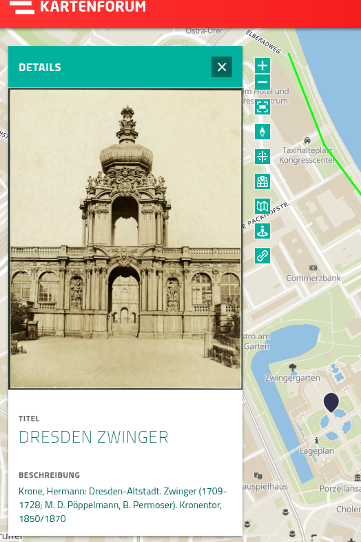

### Vector Map Information

When a vector map has been selected in the search panel, it appears in the **My Maps** panel.

To view more information of the selected vector map:

1. Hover your cursor over the desired vector map layer in the **My Maps** panel.
2. Click the **Show GeoJson Information** button.
3. The **Vector Map** panel will open.

| 2                            | 3                            |
| ---------------------------- | ---------------------------- |
| 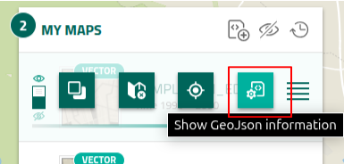 | 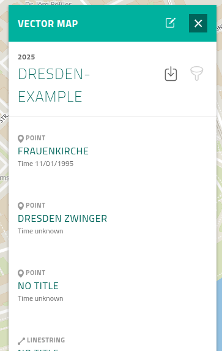 |

The **Vector Map** panel now displays the title, the time period, the description, and a list of its features.

### Feature Filtering – 'Time-Based'

You can filter visible features on the map based on their time range.

To apply a time-based filter:

1. Open the **Vector Map** panel as described in the section above.
2. Click **Filter GeoJSON features** to reveal the **Date Range** filter section.
3. Set your preferred time range by either:
    - Clicking the edit icon and entering the dates manually, or
    - Adjusting the date sliders from both ends.

| 2                            | 3                            |
| ---------------------------- | ---------------------------- |
| 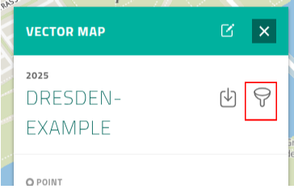 | 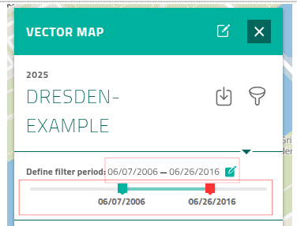 |

Features outside the selected time range will be hidden on the map, allowing you to focus only on the relevant data.

## Overlay Custom GeoJSON

### Vector Maps that Serve as a Custom Overlay

All users, including anonymous users, can create vector maps that serve as a custom overlay over raster maps. This is done by loading a GeoJSON file from your local computer into the application.

Follow these steps to create a vector map that serves as a custom overlay:

1. Click the **Vector Create** button in the **My Maps** panel.
2. Select **Add GeoJSON**.
3. Click **Drop GeoJSON file (or click)**, and select the required vector map (in GeoJSON format) and upload your file.
4. In the **Add GeoJSON Layer** panel that appears, click **Add**. (Note: The title of the vector map can be changed in this step)

| 1                            | 2                            | 3                              | 4                             |
| ---------------------------- | ---------------------------- | ------------------------------ | ----------------------------- |
| 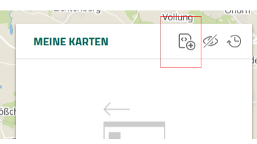 | 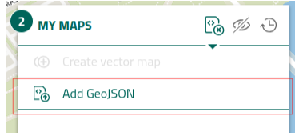 | 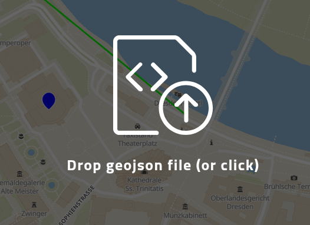 | 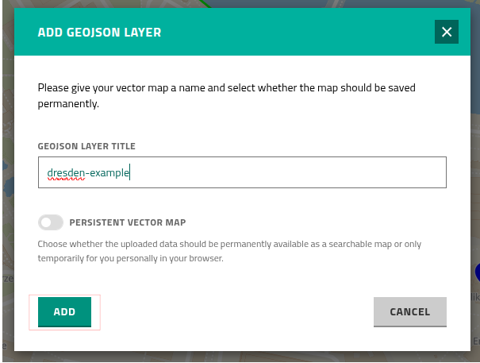 |

Note: Vector maps that serve as a custom overlay can also be [edited](/docs/Managing%20Maps/Manage%20Vector%20Maps/Edit%20Vector%20Maps)

## Share / Export Maps

VKF provides multiple ways for users to share vector maps.

### Share a Link

VKF offers three methods to share map content via links.

1. **Permalink sharing** – Shares the selected vector maps.
2. **Map-view sharing** – Shares the selected vector maps including the vector maps that serve as a custom overlay.
3. **Feature permalink sharing** - Same as permalink sharing, but directly opens the **Details panel** when accessing the shared link.

#### Permalink Sharing

Any user, including anonymous users, can share content via a permalink.

Follow these steps to create and share a permalink:

1. Select the vector maps you want to share.
2. Click the **Share current view** button (last button in the set on the right-hand side of the VKF search panel).
3. Ensure the **Permalink** section is selected.
4. Click the **Copy to clipboard** button.

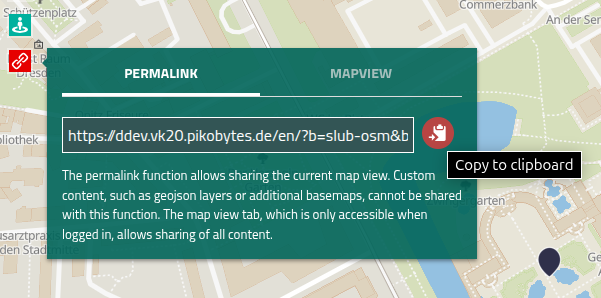

#### Map-view Sharing

You must be logged in to use map-view sharing.

Follow these steps to share a map:

1. Select the vector maps you want to share.
2. Click the **Share current view** button (last button in the set on the right-hand side of the VKF search panel).
3. Select the **Map-view** section.
4. Click the **Copy to clipboard** button.

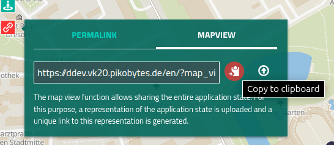

#### Feature Permalink Sharing

To share a feature via a permalink, follow these steps:

1. Select the required vector map.
2. Select a specific feature from the vector map whose information you want to share.
3. The **Details** panel will appear on the left side of the map, showing information related to the feature.
4. Click the **Feature Permalink** button in the top-right corner of the **Details** panel.

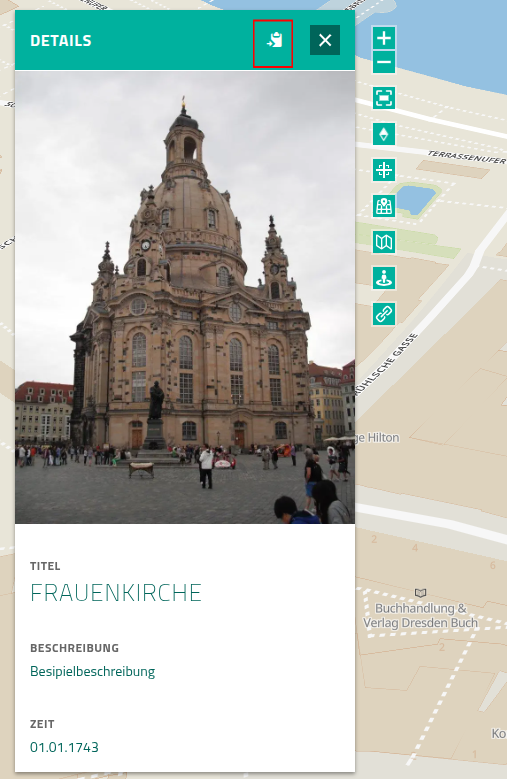

### Export GeoJSON File

The content of a vector map can also be exported as a GeoJSON file and saved locally to your computer.

Follow these steps to export a vector map as a GeoJSON file:

1. Click the **Show GeoJSON Information** button on the desired vector map within the **My Maps** panel.
2. In the opened **Vector Map** panel, click the **Export GeoJSON** button.

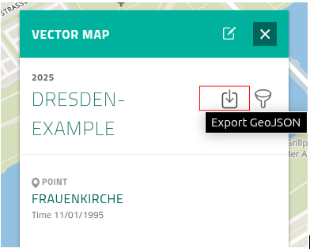

# Managing Maps

## Manage Vector Maps

### Create Vector Maps

This page guides you through the steps to create vector maps including the vector maps with an external GeoJSON source.

#### Vector Maps

Note: Only logged-in users with editor or admin roles can create vector maps.

There are two main methods that users can use to create vector maps.

**A.** Upload a vector map using files in the GeoJSON format.

1. Click the **Show Vector Map Create Options** button in the **My Maps** panel.
2. Select **Add GeoJSON**.
3. Click **Drop GeoJSON File (or Click)** , and select the required vector map (in GeoJSON format) and upload your file.
4. In the **Add GeoJSON Layer** panel that appears, click the toggle button **Persistent Vector Map** and then click **Add**.

**B.** Create a new vector map.

1. Click the **Show Vector Map Create Options** button in the **My Maps** panel, and then select **Create Vector Map** button.
2. In the **Create Vector Map** panel that appears, fill in the metadata for the map. (Note: Title, Start Date, and End Date are required.)
3. Click **Apply**.
4. Click **Save** in the panel at the bottom center of the map.

| 1                            | 2                            | 3                              | 4                             |
| ---------------------------- | ---------------------------- | ------------------------------ | ----------------------------- |
| 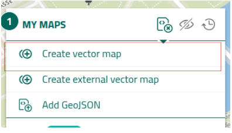 | 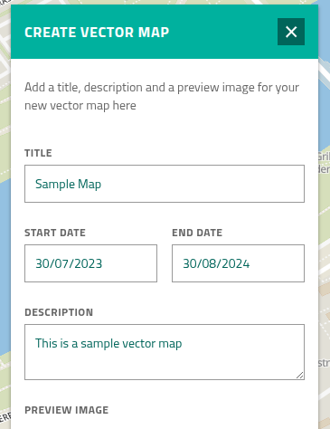 | 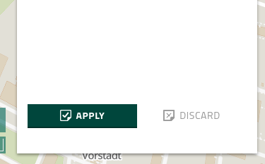 | 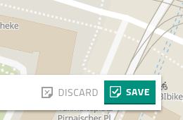 |

#### Create Vector Maps with an External Geojson Source

Note: Only Admin users are permitted to create a vector map with an external geojson source.

1. Click the **Show Vector Map Create Options** button in the **My Maps** panel and then select **Create External Vector Map**.
2. In the **Create Vector Map** panel, provide the required metadata. (Note: Title, GeoJSON URL, Start Date, and End Date are required.)
3. Click **Apply**.
4. Click **Save** in the panel at the bottom center of the map.

| 1                            | 2                             | 3                              | 4                             |
| ---------------------------- | ----------------------------- | ------------------------------ | ----------------------------- |
| 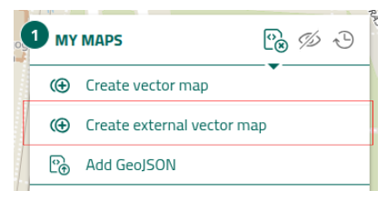 | 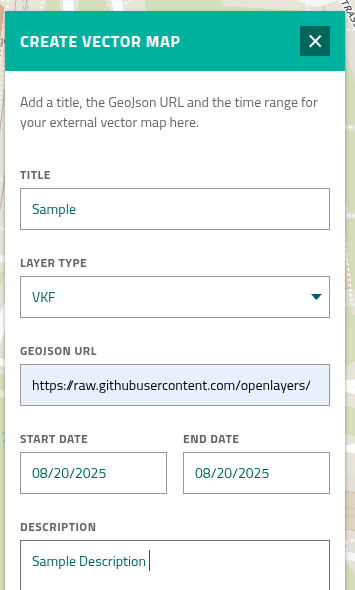 |  |  |

### Edit Vector Maps

This page explains how to edit a vector map.

#### Create a New Feature

1. Click the **Show GeoJSON Information** button on the desired vector map within the **My Map** panel.
2. Click the **Edit** button on the opened **Vector Map** panel to enter the drawing mode.
3. In the top-right corner of the drawing mode, you will find four buttons: Line, Polygon, Point, and Delete.
4. Choose a shape (Line, Polygon, or Point) from the first three buttons to start creating a feature on the map.
5. After placing the feature, a panel named **Edit Details** appears on the left-hand side.
6. Fill in the necessary information related to the created feature in this panel.
7. Click **Apply** button on the bottom of the panel.
8. Click the **Save** button located at the bottom-middle of the drawing mode.

| 1                               | 2                               | 3                                 | 5                                |
| ------------------------------- | ------------------------------- | --------------------------------- | -------------------------------- |
| 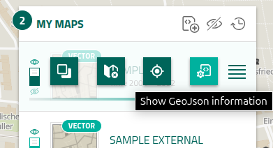 | 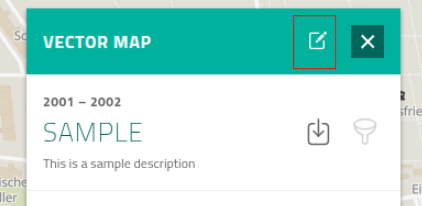 | 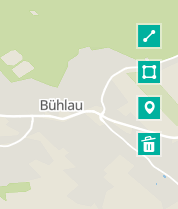 | 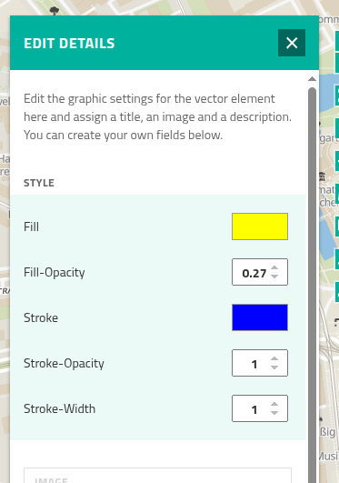 |

| 7                               | 8                               |
| ------------------------------- | ------------------------------- |
| 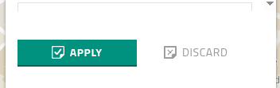 | 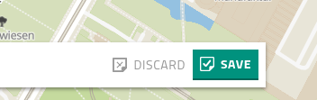 |

After saving, the user will be redirected to the map view, and the new features will appear on both the map and the **Vector Map** panel.

#### Edit an Existing Feature

Edits are made through the **Edit Details** panel. Follow the steps below to access and update a feature:

1. Click the **Show GeoJSON Information** button on the vector map in the **My Maps** panel.
2. Click the **Edit** button in the **Vector Map** panel to enter the drawing mode.
3. Select the feature you wish to edit. This opens the **Edit Details** panel on the left-hand side.

After making the required changes, click **Apply** and then **Save** on the bottom-middle panel in drawing mode.

##### Feature Appearance

The appearance of features (color, line width, etc.) can be modified depending on the shape type (Point, Line, or Polygon). These settings are available under the **Style** section of the **Edit Details** panel.

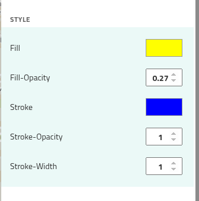

##### Feature Date

To update the feature’s date range:

-   Go to the **Time** section in the **Edit Details** panel.
-   Enter the start and end dates. Note: The end date must be equal to or later than the start date.

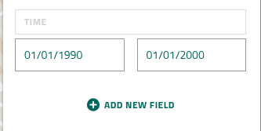

##### Add a Specific Date

Instead of a date range, the user may need to assign a specific date to a feature. In this case, enter the same date for both the start and end date.

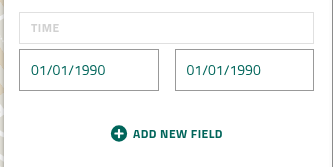

##### Feature Image

To associate an image with a feature:

-   Go to the **IMG_Link** section in the **Edit Details** panel.
-   Enter the image URL (must begin with `https://`).
-   If the image is successfully loaded, it will appear above in the **Image** section of the same panel.

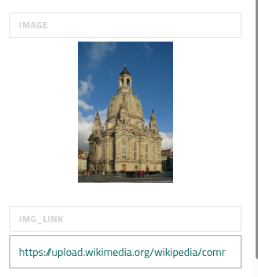

##### Feature Title / Description

To update the title or description of a feature:

-   Go to the **Title** or **Description** section in the **Edit Details** panel.
-   Enter the new title and/or description.

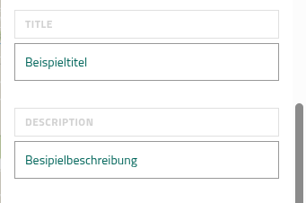

##### Add Additional Information

To add custom information fields:

1. Click the **Add New Field** button in the **Edit Details** panel.
2. Enter the title of the new field in **Enter Field Title Here** section.
3. Enter the corresponding value in **Enter Field Values Here** section.

| 1                            | 2,3                           |
| ---------------------------- | ----------------------------- |
| 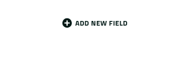 | 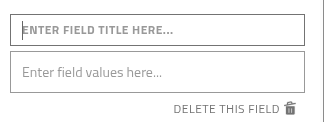 |

##### Delete a Feature

VKF provides two ways to delete a feature:

1. Click the red button labeled **Delete GeoJSON Feature** at the bottom of the **Edit Details** panel.
2. In drawing mode, click the fourth button (trash can icon) located at the top-right corner of the map interface.

| 1                            | 2                             |
| ---------------------------- | ----------------------------- |
| 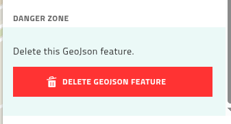 | 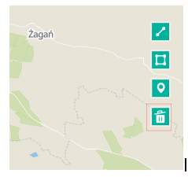 |

#### Edit Metadata

The metadata of a vector map can be modified at any time by the map's **Owner**. Only users with the **Owner** role are permitted to make changes to the metadata.

Metadata includes:

-   Title
-   Time range
-   Image
-   Description of the vector map

Follow these steps to edit the metadata:

1. Click the **Show GeoJSON Information** button on the desired vector map within the **My Maps** panel.
2. Click the **Edit** button in the opened **Vector Map** panel to enter drawing mode.
3. On the bottom panel in drawing mode, click the button **Show Vector Map Settings**.
4. A panel titled **Edit Vector Map** will appear on the right-hand side of the drawing mode. In this panel, you can update the desired metadata fields.

| 3                               | 4                            |
| ------------------------------- | ---------------------------- |
| 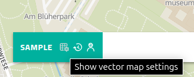 | 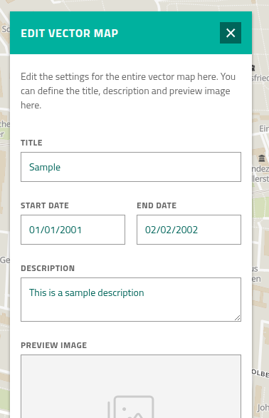 |

#### Transfer Roles

Two main user roles exist for vector maps:

1. **Owner** – Can edit the vector map, including its metadata. The creator of the vector map is automatically assigned this role.
2. **Author** – Can edit the vector map, but not its metadata.

Follow these steps to transfer a role:

1. Click the **Show GeoJSON Information** button on the desired vector map within the **My Maps** panel.
2. Click the **Edit** button in the opened **Vector Map** panel to enter drawing mode.
3. On the bottom panel in drawing mode, click the button **Show Vector Map Permission Settings**.
4. A panel titled **Adapt Authorizations** will appear, allowing you to assign Owner and Author roles.

| 3                               | 4                            |
| ------------------------------- | ---------------------------- |
| 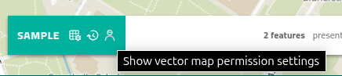 |  |

5. Enter the username of the intended recipient in the appropriate section:
    - **Creator/Owner** for Owner
    - **Authors** for Author  
      _(Note: The username must be entered exactly as registered in the system.)_
6. Click **Save User Roles** to apply the changes, and then click **Save** on the bottom panel to save the updates.

**Notes:**

-   Only Admin users can transfer the Owner role.
-   Roles can only be assigned to Admin or Editor users, as they are the only ones permitted to vector maps.

#### Control the Version

Vector maps support version control. Users can view the version history and revert a vector maps's geojson content to previous versions.

**Note:** Version control is not available for **vector maps with external geojson sources** and **vector maps that serve as a custom overlay**.

To revert or view a previous version of a vector map, follow these steps:

1. Click the **Show GeoJSON Information** button on the desired vector map within the **My Maps** panel.
2. Click the **Edit** button in the opened **Vector Maps** panel to enter drawing mode.
3. On the bottom panel in drawing mode, click the **Show Vector Map History** button.
4. A panel titled **History of the Vector Map** will appear on the right-hand side of the drawing mode, showing the list of available versions.
5. Select the version you want to view or restore. Then click the **clock** icon on the right-hand side of that version to load it into the drawing mode.
6. To save the selected version as the current version, click **Save** on the bottom panel.

| 3                               | 4                               | 5                                 | 6                                |
| ------------------------------- | ------------------------------- | --------------------------------- | -------------------------------- |
| 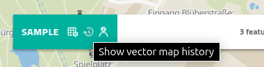 | 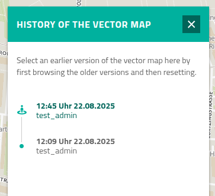 | 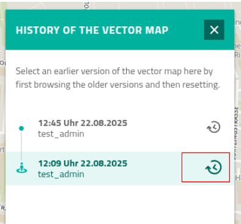 |  |

#### Delete a Vector Map

Users can delete vector maps based on their roles:

-   **Admin User** – Can delete any vector map including vector maps with external geojson sources.
-   **Editor User** – Can only delete an vector map if assigned as the owner.

Follow these steps to delete a vector map:

1. Click the **Show GeoJSON Information** button on the desired vector map within the **My Maps** panel.
2. Click the **Edit** button in the opened **Vector Map** panel to enter drawing mode.
3. On the bottom panel in drawing mode, click the **Show Vector Maps Settings** button.
4. A panel titled **Edit Vector Map** will appear on the right-hand side of the drawing mode. Scroll to the bottom of this panel and click the red **Delete Vector Map** button.
5. A confirmation dialog titled **Permanently Remove Data** will appear. Click **Yes, Delete Now** to permanently delete the map.

| 4                               | 5                               |
| ------------------------------- | ------------------------------- |
| 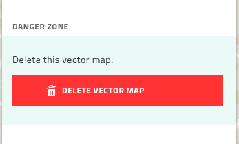 | 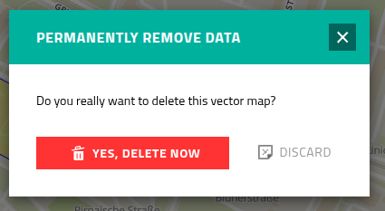 |

#### Edit Vector Maps with an External Geojson Source

##### Edit Metadata

Follow the steps below to access and update the metadata:

1. Click the **Show GeoJSON Information** button on the vector map in the **My Maps** panel.
2. Click the **Edit** button in the **Vector Map** panel to enter drawing mode.
3. This will open the **Edit Vector Map** panel on the right side of the screen.

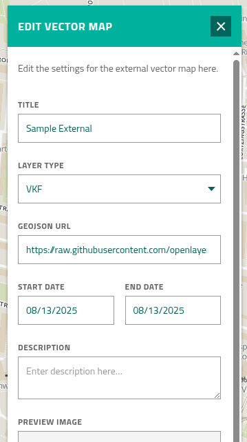

Users can change the metadata through this panel. The parameters include **Title**, **Layer type**, **GeoJSON URL**, **Date**, **Description**, and **Image**.

##### Refresh the Bounding Box

To recalculate the bounding box of the external geojson, click the **Refresh Bounding Box** button below. This will update the bounding box in the search index accordingly.

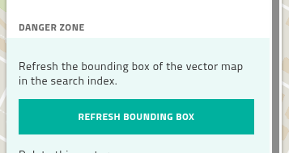

##### Delete a Vector Map with an External Geojson Source

Users can delete a vector map with an external geojson source by following these steps:

1. Click the **Show GeoJSON Information** button on the vector map in the **My Maps** panel.
2. Click the **Edit** button in the **Vector Map** panel to enter drawing mode.
3. This will open the **Edit Vector Map** panel on the right side of the screen.
4. Scroll down to the bottom of the panel, locate the red **Delete Vector Map** button, and click it.

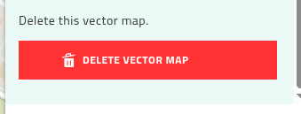

5. Another panel named **Permanently Remove Data** will appear. Click the **Yes, Delete Now** button to confirm.
